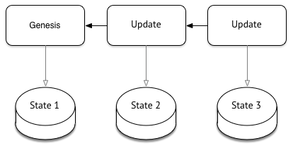
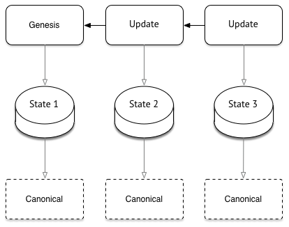

# Vessel

> Dynamic content for decentralized web.

This is a research project intended to pave a way for dynamic decentralized applications, not mere databases or blockchain dApps.

## Conceptual Overview

The best bet on decentralized web is content-addressable storage, like [IPFS/Filecoin](https://ipfs.io).
Data put there are addressable via a short string called content identifier or [CID](https://docs.ipfs.io/concepts/content-addressing/),
that is basically a cryptographic hash of the data.
This makes IPFS data immutable and gives IPFS strength. Something stored under CID could never be changed.
It is weakness, at the same time, as you could not easily change the data. You would have to put an updated version of it on IPFS,
and address to it via a _new_ CID.

Dynamic content means there is some sort of _permanent_ well-known identifier, under which changeable data live.
This could come as [DNS](https://en.wikipedia.org/wiki/Domain_Name_System), [ENS](https://ens.domains), [HNS](https://handshake.org), or [IPNS](https://docs.ipfs.io/concepts/ipns/#example-ipns-setup).
This comes at cost of updating this `identifier->cid` relation every time our data change. Another way, pioneered by [OrbitDB](https://orbitdb.org),
and then used by [Textile](https://textile.io), [Ceramic](https://www.ceramic.network) and others, is to communicate the relation via [IPFS Pubsub](https://blog.ipfs.io/25-pubsub/).
This makes maintaining the relation really easy.

For dynamic content it makes sense to structure changes as _updates_, instead of replacing the whole content.
This way we could establish lineage of changes that could be formally checked and thus operated on,
which brings a concept of _state transition_ to light. Leaning on IPFS directed acyclic graph structure,
[Merkle-CRDT](https://arxiv.org/abs/2004.00107) was proposed to structure data and state transitions as [Conflict-free replicated data type](https://en.wikipedia.org/wiki/Conflict-free_replicated_data_type),
or CRDT. It means, that updates happened at different times deterministically converge to a single state, and this does not involve human intervention.

CRDT is posed to solve problems arising from concurrent edits. It assumes existence of a cleverly constructed data structure (CRDT itself),
and a resolver. The latter applies changes, and resolves conflicts in a deterministic way. The resolver depends on type of CRDT,
and CRDT depends on constraints of the applications. Using CRDTs means either restricting application domain, or putting a heavy burden
on application developer so that she could choose or construct a proper data structure. In addition to that CRDT, by academic definition,
does not represent a lifecycle of data. For example, in a contract (paper, not smart one) signing scenario, the text of a contract could not be changed after it is signed by both parties.
DID document is expected not to be updated after revocation. You have to add business logic on top of it for data lifecycle. All in all, we can not build dynamic decentralized applications _purely_ relying on CRDT. 

We assume a piece of data is structured in a form of _document_, we call it Vessel document below. It consists of genesis record and update records, that are stored on IPFS.
Update records link to each other to form [Merkle DAG](https://docs.ipfs.io/concepts/merkle-dag/).
Genesis record _represent_ initial _state_ of the document. Update records change the state.



The document also has a linked _ruleset_, which is also stored on IPFS. The ruleset contains
an executable code that is invoked for every update record. It applies the update to the current state,
and returns the next state of the document, if the update is considered valid.
The ruleset encodes rules of state transition, which might include checking signatures, checking document lifecycle,
as well observing (and triggering) external resources, which are deemed necessary for the document
and are permitted by the node on which the ruleset is executed.
It is similar to Operation-based CRDTs `apply(state, operation) => state` function. So, at any update record in the line of changes
we could compute a corresponding version of the state. 

What the ruleset also does it provides what we call a _canonical_ form of a document. That is, it gets a current `state` and presents it in a way
that is suitable for a reader regardless of what is inside the state or how it evolves. One example of it is signing a contract. We consider
a contract to be in "draft" stage till it is signed by both parties involved. Only if it gets two signatures, the ruleset reports that canonical form of
the document is in stage of "agreement". There is no need to encode this specifically in the update records, or in genesis record.



What this brings is wide interoperability. A node that conforms to the protocol of handling such a Vessel document,
is not required to install custom per-document-type plugins. Readers of the document do not have to be concerned
with state transitions, document lifecycle or semantics of document state to retrieve canonical form of a document.

## Current Status

Consider this a research project. To have a peek on full Vessel document lifecycle go to [post-vessel-tile-remote.ts](./libs/vessel/src/integration/post-vessel-tile-remote.ts).
To run it:
1. start necessary infra (two IPFS nodes) by docker-compose: `docker-compose up`,
2. install dependencies: `pnpm install`
3. make the code executable: `pnpm run build`
4. start the node in dev mode: `pnpm run dev`,
5. run the lifecycle script: `cd libs/vessel && ../../node_modules/.bin/ts-node src/integration/post-vessel-tile-remote.ts`

The lifecycle script tracks a contract signing example. Two parties decided to agree on a contract on state of number, just a single number.
A document here contains the number, and two signatures from party A and party B.
During drafting phase (stage = `draft`), the number could only go up.
For the document to be considered an agreement (stage = 'agreement') it has to contain two signatures for the same number.
The document can not be changed after it is in agreement stage. All of this is demonstrated there in the script.

When run, you should see this on console:
```
Vessel document id DocId(bafyreibkktz2hm2kgwfqxsm3haxtvikclvx2fqm4inf7scgudqbxuv7bni)
sleeping...
Change num to 300, sigB...
Same num, sigA...
sleeping after agreement is set. call should fail...
Really failed. Cool.
```

## Concerns and Limitations

The kit contains a weird copy of 3id. This should be rejected in favour of more broad support of DID methods.

The kit, and Vessel approach do not fully handle siblings.
We should make that a responsibility of Ruleset to resolve siblings.
Siblings-resolution relies on anchoring, which should itself be moved fully to the ruleset.

Only JavaScript is supported in Ruleset. It should support WebAssembly. And, this in turns requires some sort of authoring support.

As for security, we use [SES by Agoric](https://github.com/Agoric/ses-shim) to isolate potentially unsafe code, so consider it pretty secure.
Yet, there are no limits on how many CPU/memory/network resources a ruleset consumes. 

As for the authoring, this should include generation of JSON (LD) Schema for the document state.

So, lots of stuff that could be done better.

## Development

The suite uses [pnpm](https://pnpm.js.org) package manager. You have to install it first.

For package, install dependencies:
```shell script
pnpm i
```
then run in `dev` mode which recompiles TypeScript on file changes.
```shell script
pnpm run dev
```

### Ports Used

- Anchoring: 3000
- Wheel A: 3001
- Wheel B: 3002

- Anchoring UI: 8000
- Wheel A UI: 8001
- Wheel B UI: 8002
